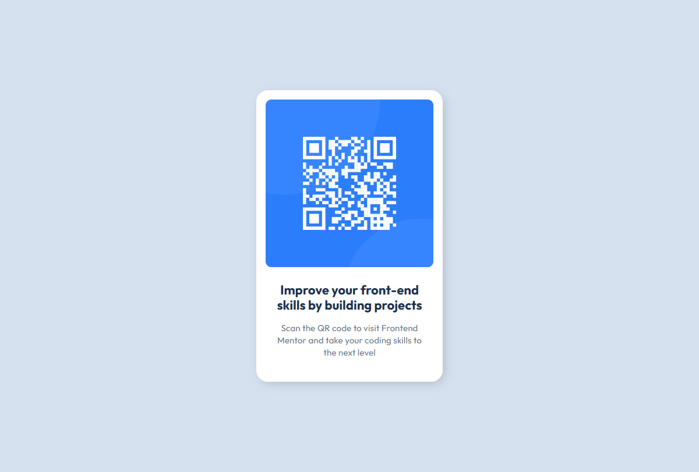

# Frontend Mentor - QR code component solution

This is a solution to the [QR code component challenge on Frontend Mentor](https://www.frontendmentor.io/challenges/qr-code-component-iux_sIO_H).

## Table of contents

- [Overview](#overview)
  - [Screenshot](#screenshot)
  - [Links](#links)
- [My process](#my-process)
  - [Built with](#built-with)
  - [What I learned](#what-i-learned)
- [Author](#author)

**Note: Delete this note and update the table of contents based on what sections you keep.**

## Overview

### Screenshot

### Links

- Solution URL: [https://github.com/Praise25/QR-Code-Component](https://github.com/Praise25/QR-Code-Component)
- Live Site URL: [https://qr-code-component-liard-seven.vercel.app/](https://qr-code-component-liard-seven.vercel.app/)

## My process

### Built with

- React
- Typescript

### What I learned

Major takeaway from this project was working with images in containers and working with box shadows.

## Author

- Frontend Mentor - [@Praise25](https://www.frontendmentor.io/profile/Praise25)
- LinkedIn - [Anene Praise](https://www.linkedin.com/in/praise-anene-07776416a/)
